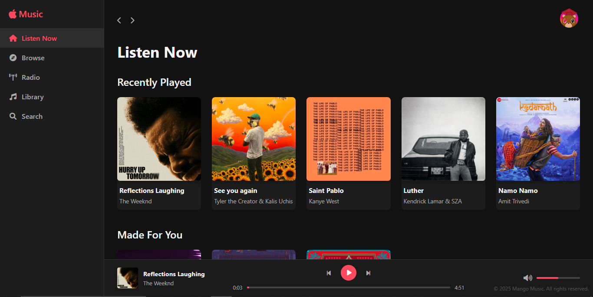

# Mango Music 🎵

A sleek, modern web-based clone of Apple Music's Web Player, built with HTML, CSS, and vanilla JavaScript.



## Features

### Core Player Functionality
- 🎧 Smooth audio playback with progress tracking
- ⏯️ Play/pause, next/previous track controls
- 🔀 Shuffle mode for randomized playback
- 🔁 Repeat mode (single track or playlist)
- 🔊 Volume controls with mute option

### User Experience
- 🌙 Toggle between light and dark themes
- 🔍 Search functionality for finding tracks quickly
- ❤️ Favorite tracks to build your collection
- 📱 Responsive design for mobile, tablet, and desktop
- ⌨️ Keyboard shortcuts for playback control

### Library Management
- 📝 Create and manage custom playlists
- 📚 View recently played tracks
- 🎨 Expanded player view with enhanced visuals
- 💾 Local storage for user preferences and history

## Technologies Used

- **Frontend**: HTML5, CSS3, Vanilla JavaScript
- **Icons**: Font Awesome
- **Audio**: HTML5 Audio API
- **Storage**: LocalStorage API

## Getting Started

### Prerequisites
- Any modern web browser (Chrome, Firefox, Safari, Edge)

### Installation

1. Clone the repository:
   ```bash
   git clone https://github.com/yourusername/mango-music.git
   ```

2. Navigate to the project directory:
   ```bash
   cd mango-music
   ```

3. Open `index.html` in your browser or use a local server:
   ```bash
   # Using Python for a simple server
   python -m http.server 8000
   # Then visit http://localhost:8000 in your browser
   ```

## Project Structure

```
mango-music/
├── index.html                # Main HTML file
├── styles.css                # CSS styles
├── script.js                 # JavaScript functionality
└── src/                      # Source files
    ├── img/                  # Album artwork and icons
    └── music/                # Music files (.mp3)
```

## Usage

### Playing Music
- Click on any track card to play that song
- Use the controls at the bottom to navigate between tracks
- Click the expand button to enter the immersive player view

### Creating Playlists
1. Click the "Create Playlist" button
2. Enter a name and optional description
3. Add songs to your playlist by clicking the "+" icon on any track

### Keyboard Shortcuts
- **Space**: Play/Pause
- **Left Arrow**: Previous track
- **Right Arrow**: Next track
- **M**: Mute/Unmute
- **F**: Toggle favorite for current track

## Customization

### Adding Your Own Music
1. Add your .mp3 files to the `src/music/` directory
2. Update the `songs` array in `script.js` with your track information
3. Add album artwork to the `src/img/` directory

### Changing Theme Colors
Modify the CSS variables in the `:root` selector within `styles.css` to customize the color scheme.

## Roadmap

- [ ] Implement audio visualizations
- [ ] Add drag-and-drop playlist management
- [ ] Create user accounts with cloud storage
- [ ] Add music recommendation algorithm
- [ ] Support for podcasts and audiobooks

## Contributing

Contributions are welcome! Please feel free to submit a Pull Request.

1. Fork the project
2. Create your feature branch (`git checkout -b feature/amazing-feature`)
3. Commit your changes (`git commit -m 'Add some amazing feature'`)
4. Push to the branch (`git push origin feature/amazing-feature`)
5. Open a Pull Request

## License

This project is licensed under the MIT License - see the LICENSE file for details.

## Acknowledgments

- Design inspired by Apple Music
- Icons provided by Font Awesome
- Sample music tracks for demo purposes only

---

Built by [Naman](https://github.com/NamanOG)